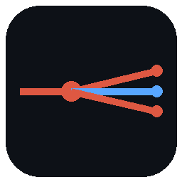
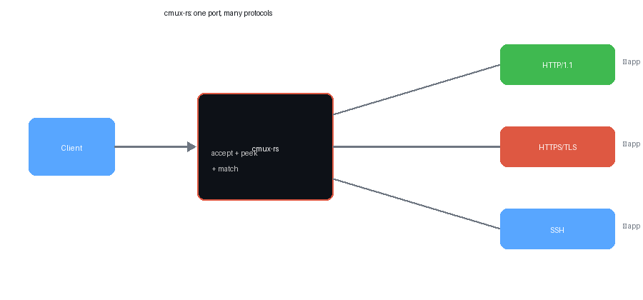

<div align="center">
  
  <h1>cmux-rs</h1>
  <p><strong>Connection multiplexer for Rust — serve multiple protocols on a single TCP port</strong></p>
  <p>
    <a href="#the-problem">The Problem</a> ·
    <a href="#install">Install</a> ·
    <a href="#quick-start">Quick Start</a> ·
    <a href="#matchers">Matchers</a> ·
    <a href="#architecture">Architecture</a>
  </p>
  <p>
    
    
    
    
  </p>
</div>

**cmux-rs** lets one TCP listener serve HTTP/1.1, HTTPS/TLS, SSH, HTTP/2, gRPC —
and your own custom protocols — by inspecting the first bytes of every
connection and routing it to the right handler. No proxy, no sidecar, no extra
port.

This is the Rust + Tokio answer to Go's
[`cmux`](https://github.com/soheilhy/cmux), built async-first and
Windows-native.

<p align="center">
  
</p>

---

## The Problem

Every network service usually wants its own port:

| Service     | Port |
| ----------- | ---- |
| HTTP API    | 8080 |
| HTTPS / TLS | 8443 |
| gRPC        | 9090 |
| SSH         | 22   |

But clients often only have **one** port open — through a firewall, a load
balancer, or a cloud ingress. `cmux-rs` collapses them into a single listener
and decides per-connection where the traffic belongs.

---

## Install

Add to your `Cargo.toml`:

```toml
[dependencies]
cmux-rs = "0.1"
tokio = { version = "1", features = ["full"] }
```

Or build from source:

```bash
git clone https://github.com/ZachDreamZ/cmux-rs.git
cd cmux-rs
cargo build --release
```

---

## Quick Start

Serve HTTP and HTTPS (here, generic TLS) on the **same** port:

```rust
use cmux_rs::matchers::{any, http1_fast, tls};
use cmux_rs::Cmux;
use tokio::io::{AsyncReadExt, AsyncWriteExt};
use tokio::net::TcpListener;

#[tokio::main]
async fn main() -> std::io::Result<()> {
    let listener = TcpListener::bind("127.0.0.1:8080").await?;

    let (mux, mut http_l) = Cmux::new(listener).match_fn(http1_fast());
    let (mux, mut tls_l)  = mux.match_fn(tls());
    let (_mux, mut any_l) = mux.match_fn(any());

    tokio::spawn(async move {
        while let Some(mut s) = http_l.accept().await {
            let _ = s.write_all(b"HTTP connection\n").await;
        }
    });
    tokio::spawn(async move {
        while let Some(mut s) = tls_l.accept().await {
            let _ = s.write_all(b"TLS connection\n").await;
        }
    });
    tokio::spawn(async move {
        while let Some(mut s) = any_l.accept().await {
            let _ = s.write_all(b"other\n").await;
        }
    });

    // Start the multiplexer
    mux.serve().await
}
```

Run the included examples:

```bash
cargo run --example simple   # HTTP + TLS + catch-all on :8080
cargo run --example multi    # HTTP + gRPC + SSH + catch-all on :8080
```

---

## Matchers

Matchers are `fn(&[u8]) -> bool` — they look at the connection's first bytes
and return `true` if the protocol matches. Order matters: matchers are tried in
registration order, and the **first** match wins.

| Matcher          | Detects                                          |
| ---------------- | ------------------------------------------------ |
| `http1_fast()`   | HTTP/1.x methods (`GET `, `POST `, ...)          |
| `tls()`          | TLS handshake record (`0x16 0x03 0xNN`)          |
| `ssh()`          | `SSH-` identification string                     |
| `http2()`        | HTTP/2 connection preface                        |
| `grpc()`         | HTTP/2 preface or `content-type: application/grpc` |
| `any()`          | catch-all — always matches (use last)            |

### Custom matchers

Any `Arc<dyn Fn(&[u8]) -> bool>` works — write your own protocol detector
inline:

```rust
use std::sync::Arc;
use cmux_rs::{Cmux, Matcher};
use tokio::net::TcpListener;

#[tokio::main]
async fn main() -> std::io::Result<()> {
    let listener = TcpListener::bind("127.0.0.1:8080").await?;
    let my_proto: Matcher = Arc::new(|peek| peek.starts_with(b"MYPROTO"));
    let (mux, _my_l) = Cmux::new(listener).match_fn(my_proto);
    mux.serve().await
}
```

---

## How It Works

1. **Accept** — `Cmux` wraps a `TcpListener` and accepts connections.
2. **Peek** — the first `peek_len` bytes (default 4096) are read but **not
   consumed**.
3. **Match** — matchers run in order; the first `true` wins.
4. **Dispatch** — the connection (with its peeked bytes intact) is sent to the
   matching virtual listener.
5. **Serve** — your handler calls `accept()` and reads the `BufferedStream` as a
   normal `TcpStream`. Peeked bytes are replayed first, so no data is lost.

See [`ARCHITECTURE.md`](ARCHITECTURE.md) for the full design.

---

## Platform Support

`cmux-rs` is built on Tokio's `net` and `io` primitives, so it works
**natively on Windows, Linux, and macOS** with no extra dependencies.

---

## License

MIT
